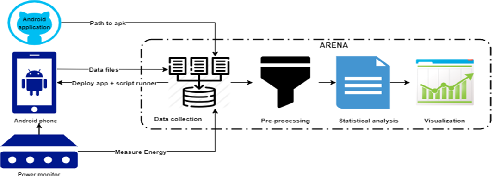

ARENA (Analyzing eneRgy Efficiency in aNdroid Apps) is a tool developed to assist developers and researchers in improving the energy efficiency of Android applications. Integrated as a plugin for Android Studio and IntelliJ IDEs, ARENA automates the energy measurement and analysis process, providing actionable insights into the energy impact of code changes and third-party libraries. This tool emerged from research focused on evaluating the energy impact of various code smell refactorings and third-party libraries used in Android apps, aiming to promote greener software engineering practices.  #energy-efficiency, #Android-development, #profiling-tool, #Android
#EnergyEfficiency, #GreenAI, #SoftwareEngineering, #Sustainability

## Requirements for installing ARENA
1.	The host system must have JAVA version 1.8 or above
2.	Install Python 3.0 or above from here and add to the path of system environment variables.
3.	Install Monsoon Power Monitor, and it’s related Python libraries as per the user manual of Monsoon Power Monitor.
4.	Install R from here with version 3.4.3. or above. Path to ./bin, ./bin/R.exe, and ./bin/Rscript.exe must be added to the path in System Environment Variables. 
5.	Install Rtools from here. Path to ./usr/bin must be added to the Path of System Environment Variables
6.	Make sure no other instance of R is running.
7.	The plugin will install the following R libraries automatically. However, in case of any un foreseen errors ARENA user can also install them manually using R : dplyr, ggpubr, RColorBrewer, ggplot, officer, flextable, propagate, pgirmess, RVAideMemoire, pastecs. 
 
 
8.	The mobile device must be a rooted device.
9.	If test APK is selected, make sure it has a TestClass that runs all the instrumented tests. 
10.	The application under test must have API version >= 19

## PLUGIN INSTALLATION

1.	Open Intellij Idea. Go to File > Settings > Plugin. 
2.	Click on Settings icon and click Install Plugin From Disk
3.	Choose the EnergyPlugin-1.0-SNAPSHOT.zip file 
4.	Click on OK. Restart IDE to start using the plugin.

## Additional Resources

[Towards Greener Software Engineering Using Software Analytics](https://dspace.ut.ee/items/f0a5815c-3c50-4f8e-9fc0-b0d2b3674fbf)

YouTube Video: [Talk by Dr. Hina Anwar](https://www.youtube.com/watch?v=pIDtDRuGKls)
